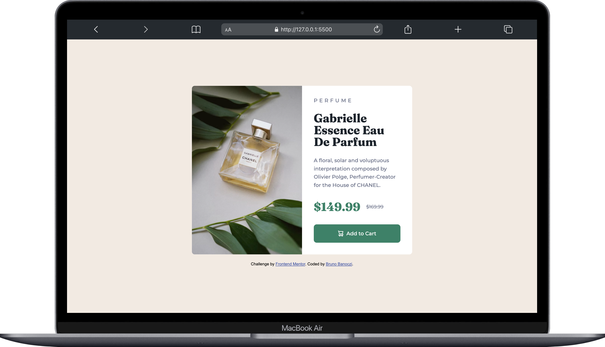
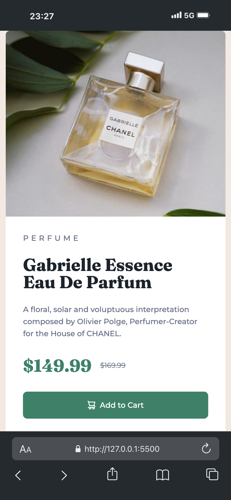

# Frontend Mentor - Product preview card component solution

This is a solution to the [Product preview card component challenge on Frontend Mentor](https://www.frontendmentor.io/challenges/product-preview-card-component-GO7UmttRfa). Frontend Mentor challenges help you improve your coding skills by building realistic projects.

## Table of contents

- [Overview](#overview)
  - [The challenge](#the-challenge)
  - [Screenshot](#screenshot)
  - [Links](#links)
- [My process](#my-process)
  - [Built with](#built-with)
  - [What I learned](#what-i-learned)
  - [Continued development](#continued-development)
  - [Useful resources](#useful-resources)
- [Author](#author)
- [Acknowledgments](#acknowledgments)

## Overview

### The challenge

Users should be able to:

- View the optimal layout depending on their device's screen size
- See hover and focus states for interactive elements

### Screenshots

<table>
  <tr>
    <td></td>
    <td></td>
  </tr>
</table>

### Links

- Solution URL: [https://www.frontendmentor.io/solutions/product-preview-card-component-8x8Rw6FX2\_](https://www.frontendmentor.io/solutions/product-preview-card-component-8x8Rw6FX2_)
- Live Site URL: [https://l4r4tw.github.io/Product-preview-card-component/](https://l4r4tw.github.io/Product-preview-card-component/)

## My process

### Built with

- Semantic HTML5 markup
- CSS custom properties
- Flexbox

### What I learned

I learned useful responsive practises.

### Continued development

In the future I want to improve my responsive design knowledge, and start practicing with CSS grid.

### Useful resources

- [StackOverflow](assets/Screenshots/screenshot2.png) - Helped me to solve exact problems.
- [ChatGPT](https://chatgpt.com/) - Gave me perfect solutions to complex questions.

## Author

- Frontend Mentor - [@L4r4TW](https://www.frontendmentor.io/profile/L4r4TW)
- Twitter - [@L4r4TW](https://x.com/L4r4TW)
- LinkdedIn - [bruno-banoczi-csernak](https://www.linkedin.com/in/bruno-banoczi-csernak/)

## Acknowledgments

As always, ChatGPT got my back.
